<div align="center"></div>

<h1 align="center">NixOS Config</h1>

<div align="center">


</div>

## 📝 About

A wannabe size fits it all NixOS Configuration using flakes.
It is encouraged to try modify and break it all you like!
Don't believe me? Look at the ["License"](./UNLICENSE) :D

## 📖 Content

- [✨ Features](#-features)
- [📚 Layout](#-layout)
- [⚙️ Components](#%EF%B8%8F-components)
- [🖼️ Gallery](#%EF%B8%8F-gallery)
- [🐚 Shell Aliases](#-shell-aliases)
- [⌨️ Keybinds](#%EF%B8%8F-keybinds)
- [🖥️ Hosts](#%EF%B8%8F%EF%B8%8F-hosts)
- [👀 Topology](#-network-topology)

## ✨ Features

- ❄️ [Flakes](https://nixos.wiki/wiki/flakes)
- 🏡 [Home-Manager](https://github.com/nix-community/home-manager)
- 🪟 [WSL](https://github.com/nix-community/NixOS-WSL)
- 🥧 [Raspberry Pi](https://github.com/nix-community/raspberry-pi-nix)
- 💽 [Disko](https://github.com/nix-community/disko)
- ⚠️ [Impermanence](https://github.com/nix-community/impermanence)
- 🔐 [Sops-nix](https://github.com/Mic92/sops-nix)
- ♻️ [Nixos-anywhere](https://github.com/nix-community/nixos-anywhere)
- 🔒 [Lanzaboote](https://github.com/nix-community/lanzaboote)
- 🌐 [Topology](https://github.com/oddlama/nix-topology)
- 🐱 [Catppuccin](https://github.com/catppuccin/nix)
- 💈 [Stylix (WIP)](https://github.com/danth/stylix)
- 🖥️ [Minecraft Servers](https://github.com/Infinidoge/nix-minecraft)

> \[!NOTE\]
> This Config was supposed to be Catppuccin only, until I got bored of it,
> which is why Stylix was added as an afterthought. It is very incomplete!
> Help is appreciated!

## 📚 Layout

- [flake.nix](./flake.nix) ❄️ base of the configuration
- [desktop](./desktop) 🖥️ Desktop modules
  - [wallpapers](./desktop/wallpapers) 🌄 Wallpaper Collection
- [hardware](./hardware) ⚙️ Hardware modules
- [hosts](./hosts) 👻 per-host machine specific configurations
- [programs](./programs) 1️⃣ mandatory programs and optional to enable modules
- [services](./services) 0️⃣ nice to have services extracted into own modules with sensible defaults for easier setup
- [system](./system) 🖥️ system critical modules
- [topology](./topology) 🌐 global topology settings

## ⚙️ Components

| Component               | Choice(s)                                                                                                                                        |
| ----------------------- | ------------------------------------------------------------------------------------------------------------------------------------------------ |
| Window Manager          | [Hyprland](https://github.com/hyprwm/Hyprland)                                                                                                   |
| Bar                     | [Hyprpanel](https://github.com/Jas-SinghFSU/HyprPanel)                                                                                           |
| App Launcher            | [Rofi-wayland](https://github.com/lbonn/rofi)                                                                                                    |
| Notification Daemon     | [Hyprpanel](https://github.com/Jas-SinghFSU/HyprPanel)                                                                                           |
| Terminal Emulator       | [Kitty](https://github.com/kovidgoyal/kitty)                                                                                                     |
| Shell                   | [Bash](https://www.gnu.org/software/bash/) + [Nushell](https://github.com/nushell/nushell) + [Starship](https://github.com/starship/starship)    |
| Text Editor             | [Vscodium](https://github.com/VSCodium/vscodium) + [Helix](https://github.com/helix-editor/helix) + [Zed](https://github.com/zed-industries/zed) |
| Networking              | [NetworkManager](https://networkmanager.dev/) + [network-manager-applet](https://gitlab.gnome.org/GNOME/network-manager-applet)                  |
| System resource monitor | [Btop](https://github.com/aristocratos/btop)                                                                                                     |
| File Manager            | [Dolphin](https://invent.kde.org/system/dolphin) + [Broot](https://github.com/Canop/broot) + [Yazi](https://github.com/sxyazi/yazi)              |
| Fonts                   | [FiraCode Nerd Font](https://github.com/ryanoasis/nerd-fonts) + [JetBrainsMono Nerd Font](https://github.com/ryanoasis/nerd-fonts)               |
| Color Scheme            | [Catppuccin](https://github.com/catppuccin/nix) + [Stylix](https://github.com/danth/stylix)                                                      |
| Cursors                 | [Catppuccin Cursors](https://github.com/catppuccin/nix) + [Stylix](https://github.com/danth/stylix)                                              |
| Icons                   | [Catppuccin Icons](https://github.com/catppuccin/nix) + [Stylix](https://github.com/danth/stylix)                                                |
| Lockscreen              | [Hyprlock](https://github.com/hyprwm/hyprlock)                                                                                                   |
| Media Player            | [mpv](https://github.com/mpv-player/mpv)                                                                                                         |
| Music Player            | [Spicetify](https://spicetify.app/)                                                                                                              |
| Screenshotting          | [grimblast](https://github.com/hyprwm/contrib/tree/main/grimblast)                                                                               |
| Screen Recording        | [OBS](https://github.com/obsproject/obs-studio)                                                                                                  |
| Clipboard               | [wl-clipboard-rs](https://github.com/YaLTeR/wl-clipboard-rs) + [CopyQ](https://github.com/hluk/CopyQ)                                            |
| Color Picker            | [Hyprpicker](https://github.com/hyprwm/hyprpicker)                                                                                               |
| Touch Screen Gestures   | [Hyprgrass](https://github.com/horriblename/hyprgrass)                                                                                           |

## 🖼️ Gallery

<details open>
<summary>Catppuccin (Mocha)</summary>
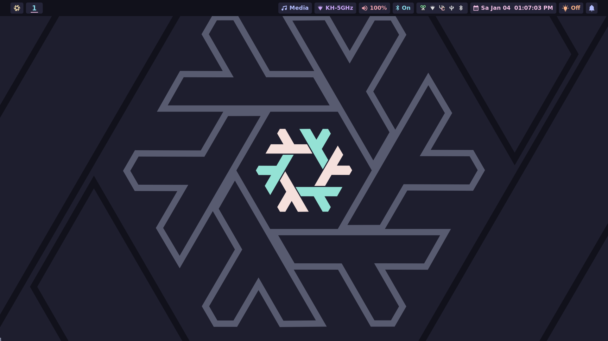
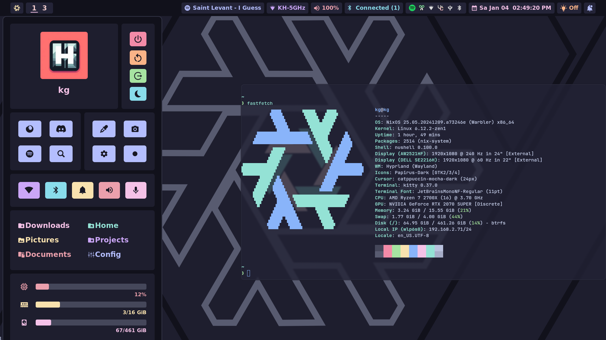
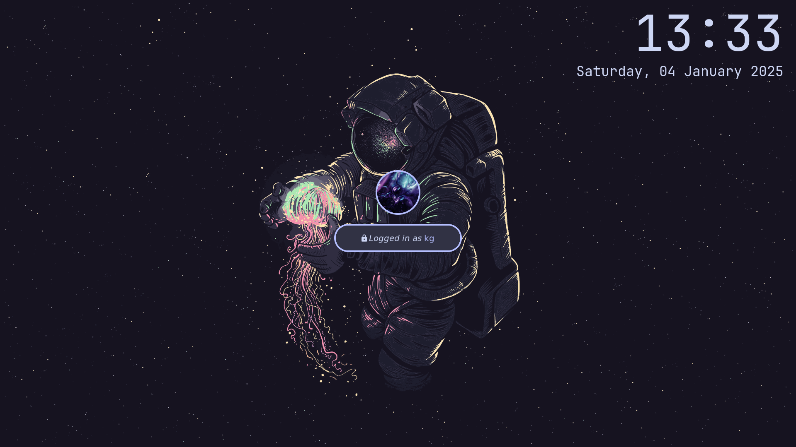
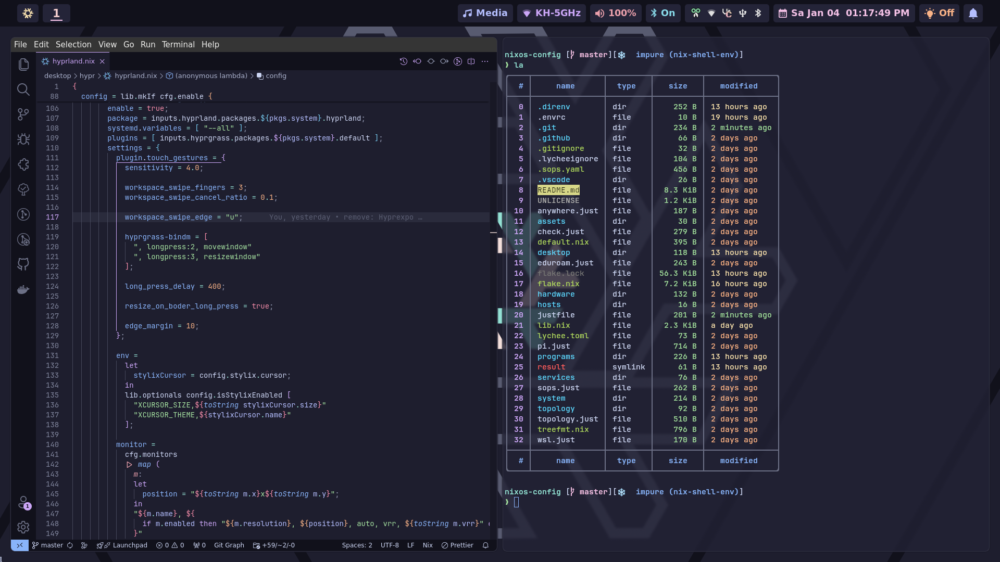
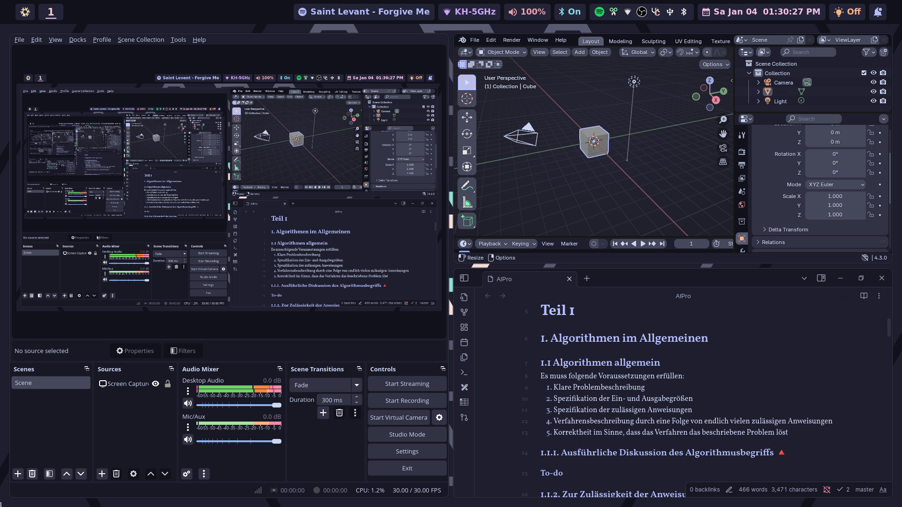
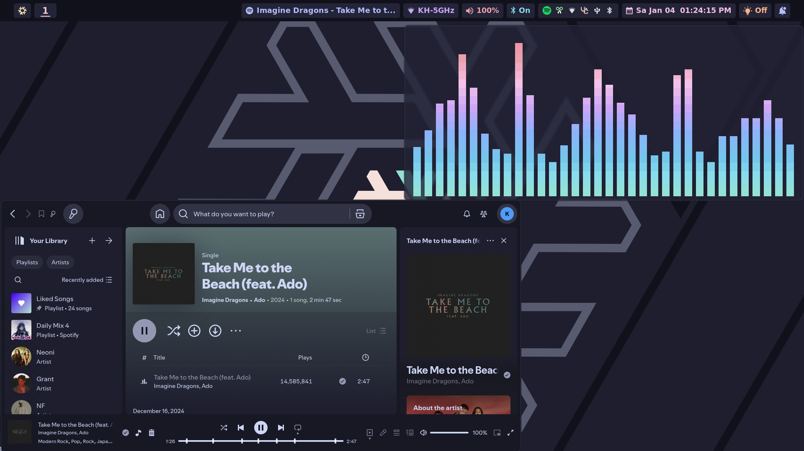
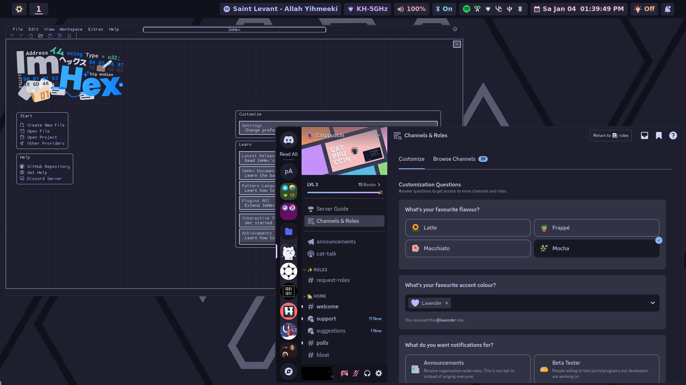
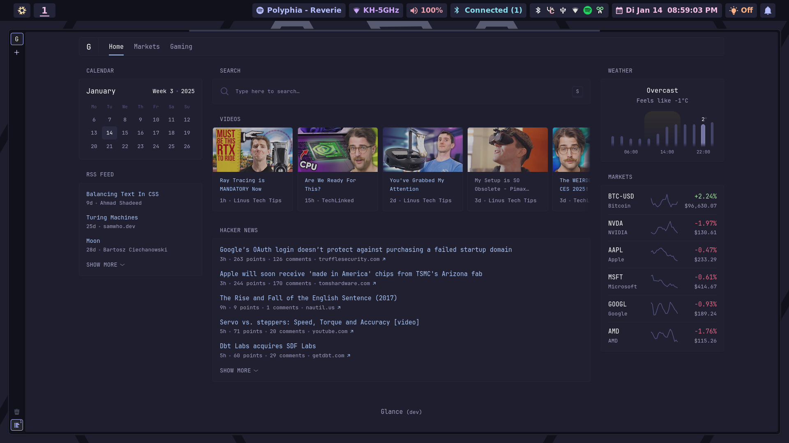
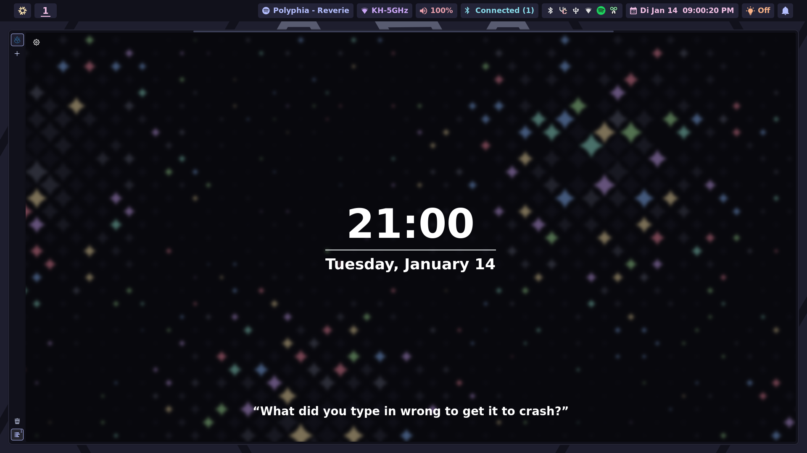
</details>

<!-- TODO: Stylix -->

<details>
<summary>Stylix (WIP)</summary>
<p>Nothing to See yet :)</p>
</details>

## 🐚 Shell aliases

For Bash:

```sh
alias cd = z
alias ls = lsd
alias la = lsd -A
alias ll = lsd -l
alias lt = lsd --tree
alias lla = lsd -lA
alias llt = lsd -l --tree
```

For Nushell:

```nu
alias cd = z
alias fd = fd --hidden
alias la = ls -a
alias ll = ls -l
alias lla = ls -l -a
```

and more at [nushell.nix](./programs/cli/shells/nushell/default.nix)

## ⌨️ Keybinds

Look at the [Hyprland.nix](./desktop/hypr/hyprland.nix) file

## ️🖥️ Hosts

| Hostname | Board             | CPU                 | RAM        | GPU                   | Role | OS  |
| -------- | ----------------- | ------------------- | ---------- | --------------------- | ---- | --- |
| kg       | B450 Steel Legend | Ryzen 7 2700X       | 16GB DDR4  | RTX 2070 Super        | 🖥️   | ❄️  |
| tp       | Lenovo Yoga 370   | Intel Core i7-7600U | 8GB DDR4   | Intel HD Graphics 620 | 💻   | ❄️  |
| ws       | WSL               | WSL                 | WSL        | WSL                   | 🖥️   | ❄️  |
| rs       | Raspberry Pi 400  | ARM-Cortex-A72-CPU  | 4GB LPDDR4 | Broadcom bcm2711-vc5  | 🗄️   | ❄️  |

## 👀 Network Topology

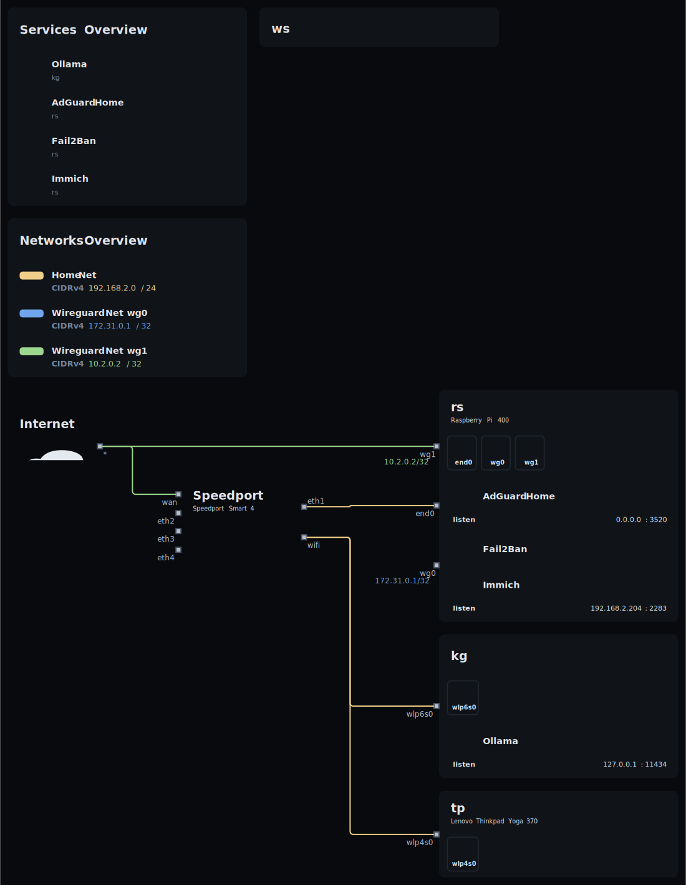

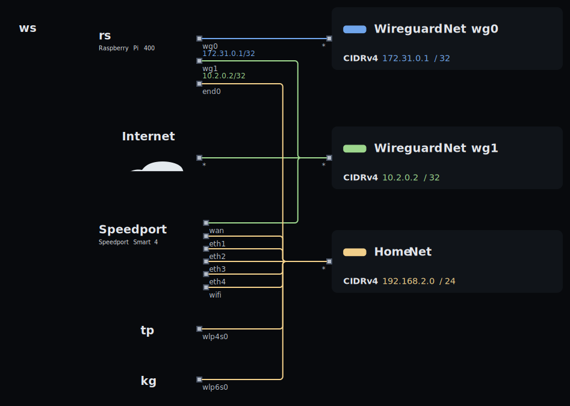
