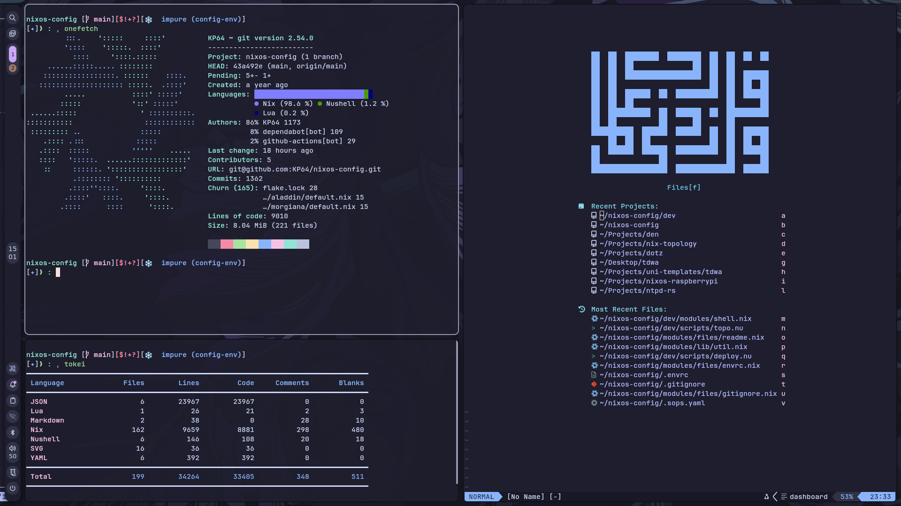
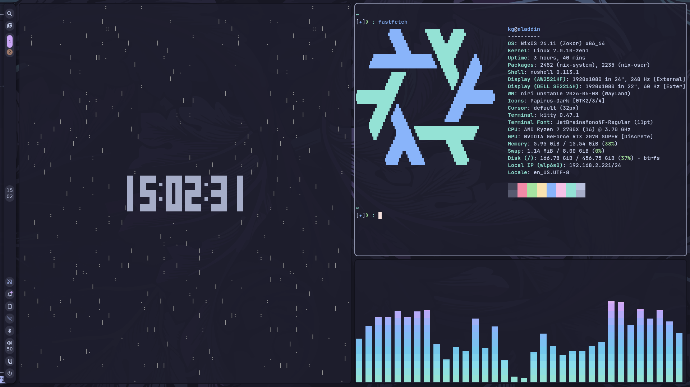
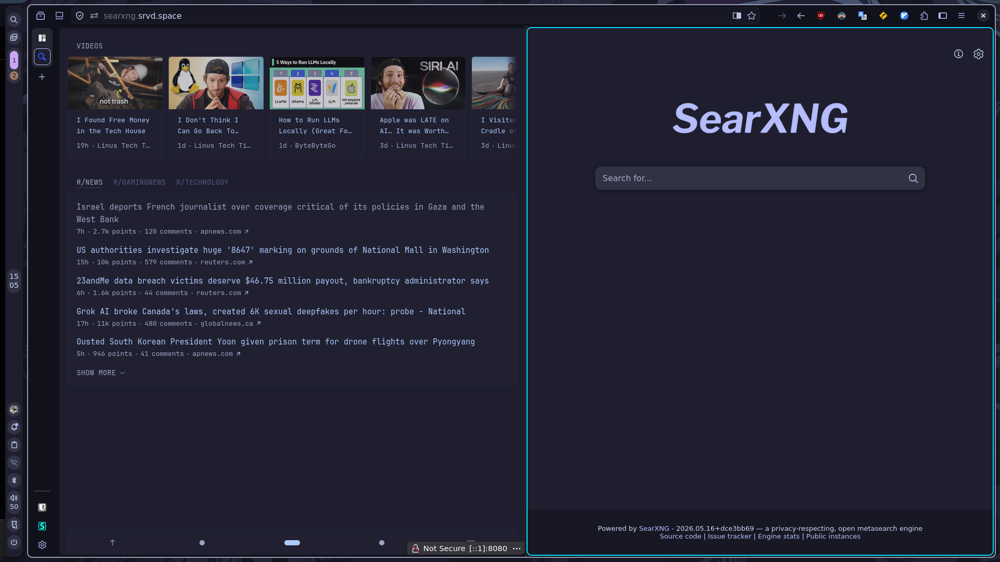

# Nix Config

## 📝 About

A wannabe size fits it all NixOS Configuration using flakes.
It is encouraged to try, modify and break it all you like!
Don't believe me? Look at the ["License"](UNLICENSE) :D

## Hosts

|                   Name                   |                  Hardware                   |     Arch      |
| :--------------------------------------: | :-----------------------------------------: | :-----------: |
|     [aladdin](modules/hosts/aladdin)     |   AMD Ryzen 7 2700X Eight-Core Processor    | x86_64-linux  |
|       [mahdi](modules/hosts/mahdi)       | 2xIntel(R) Xeon(R) CPU E5-2698 v3 @ 2.30GHz | x86_64-linux  |
|    [morgiana](modules/hosts/morgiana)    |                 ARM Limited                 | aarch64-linux |
| [sheherazade](modules/hosts/sheherazade) |                 ARM Limited                 | aarch64-linux |
|       [zarqa](modules/hosts/zarqa)       |                 ARM Limited                 | aarch64-linux |

> [!Note]
> Some hosts like `sindbad` are not managed by Nix and therefore not added here.
> The users on these hosts are managed via standalone Home-Manager.

## Gallery

  
Catppuccin

  
  
  

## 🌐 Network Topology

